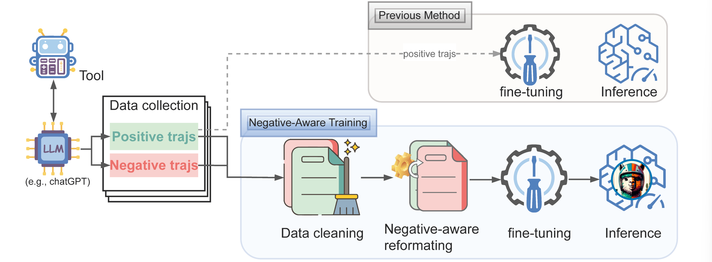
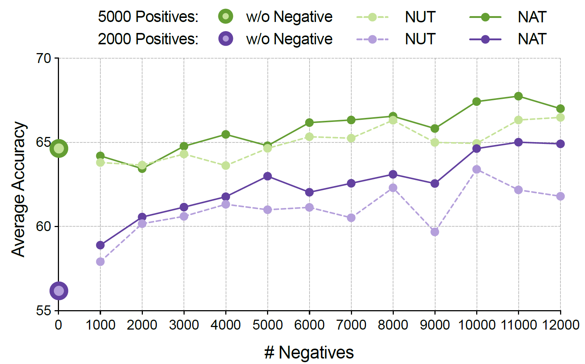
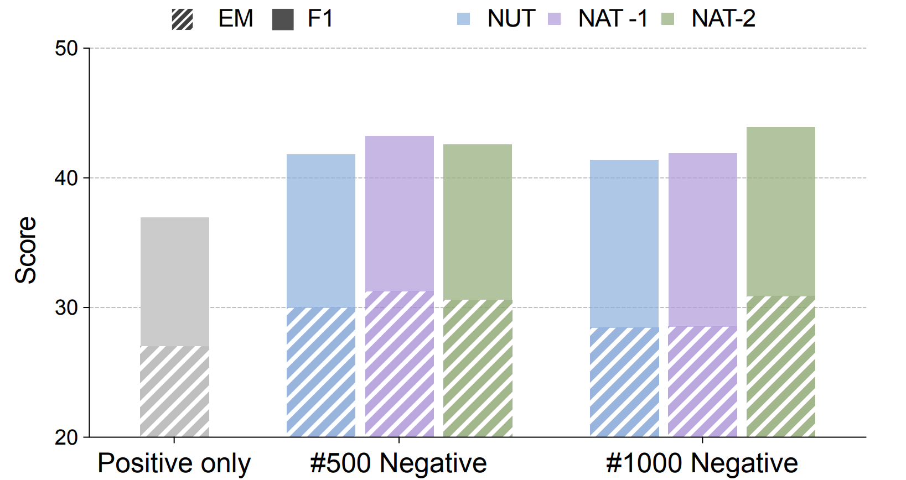

# Learning From $\textcolor{BrickRed}{\mathbf{Failure}}$: Integrating Negative Examples when Fine-tuning Large Language Models as Agents

<p align="center">
    <a href="https://huggingface.co/reasonwang/NAT-math-13b">🤗Model (NAT-math-13b)</a>
    • 
	<a href="https://arxiv.org/pdf/2402.11651.pdf">📄Paper (arxiv)</a>
	• 
    <a href="https://huggingface.co/datasets/reasonwang/NATInstruct">🤗Dataset (math, qa)</a>
</p>




**NAT (Negative-Aware Training)** aims to push the limit of data efficiency by incorporating negative trajectories when fine-tuning Large Language Models as Agents. We find models' performance increases as we include more negative samples. Besides, our method (NAT) shows superior performance compared to directly including negative samples.


## Main Results



**Figure 1** and **Figure 2** show the result on math and question-answering tasks. For math, our method continues to enhance the performance when incorporating more negative samples. For both math and QA, our method achieves better results.

## NATInstruct

We use GPT-3.5 to collect trajectories of math and question-answering tasks. Detailed statistics can be found in **Table 1**. It is also available at [🤗NATInstruct](https://huggingface.co/datasets/reasonwang/NATInstruct). 

## NAT Models

Our NAT models are trained with negative-aware training method based on Llama-2-chat. Each model is trained with both positive and negative samples. All model links can be found in **Table 1**.

| 🤗Model                                                       | 📂Dataset(#Num)                                               |
| ------------------------------------------------------------ | ------------------------------------------------------------ |
| [NAT-math-7b](https://huggingface.co/reasonwang/NAT-math-7b) | [gsm8k positive](https://github.com/Reason-Wang/NAT/blob/master/data/dataset/gsm8k/gsm8k_gpt-3.5_positive.json)(5,100) |
| [NAT-math-13b](https://huggingface.co/reasonwang/NAT-math-13b) | [gsm8k negative](https://github.com/Reason-Wang/NAT/blob/master/data/dataset/gsm8k/gsm8k_gpt-3.5_negative.json)(12,150) |
| [NAT-qa-7b](https://huggingface.co/reasonwang/NAT-qa-7b)     | [hotpotqa positive](https://github.com/Reason-Wang/NAT/blob/master/data/dataset/hotpotqa/hotpotqa_gpt-3.5_positive.json)(2,147) |
| [NAT-qa-13b](https://huggingface.co/reasonwang/NAT-qa-13b)   | [hotpotqa negative](https://github.com/Reason-Wang/NAT/blob/master/data/dataset/hotpotqa/hotpotqa_gpt-3.5_negative.json)(2,425) |
| [NAT-strategy-qa-7b](https://huggingface.co/reasonwang/NAT-strategy-qa-7b) | [strategyqa positive](https://github.com/Reason-Wang/NAT/blob/master/data/dataset/strategyqa/strategyqa_gpt-3.5_positive.json)(1,070) |
| [NAT-strategy-qa-13b](https://huggingface.co/reasonwang/NAT-strategy-qa-13b) | [strategyqa negative](https://github.com/Reason-Wang/NAT/blob/master/data/dataset/strategyqa/strategyqa_gpt-3.5_negative.json)(1,263) |

**Table 1**: Models and datasets.

## Interactive

You can try our model using the interactive script:

```bash
python -m utils.interactive \
  --model_name_or_path reasonwang/NAT-math-7b \
  --task math
```

## Training

Run the following command or `scripts/train.sh` to train a Llama-2-chat model on gsm8k task. Important arguments are:

- *pos_path* and *neg_path*: specify the path of positive trajectories and negative trajectories; 
- *pos_num* and *neg_num*: number of positive and negative trajectories;

```bash
torchrun --nproc_per_node=4 --nnodes=1 --master_port=29522 train/train.py \
  --model_name_or_path meta-llama/Llama-2-7b-chat-hf \
  --task_name gsm8k --template zero-shot-target-aware \
  --pos_path data/dataset/gsm8k/gsm8k_gpt-3.5_positive.json \
  --neg_path data/dataset/gsm8k/gsm8k_gpt-3.5_negative.json \
  --neg_num 10000 --prompt_path prompts/gsm8k/gsm8k_conversation.json \
  --question_path data/dataset/gsm8k/train.json \
  --deepspeed configs/deepspeed_z3_config.json \
  --output_dir data/checkpoints/NAT-7b-math \
  --num_train_epochs 2 --per_device_train_batch_size 2 \
  --gradient_accumulation_steps 8 --save_strategy no \
  --learning_rate 5e-5 --weight_decay 0.0 --warmup_ratio 0.03 \
  --lr_scheduler_type cosine --logging_strategy steps \
  --logging_steps 4 --model_max_length 4096 --bf16 True
```

## Evaluation

Run the following command or `scripts/evaluate.sh` to evaluate a model.

```bash
python -m data.generate --model reasonwang/NAT-math-7b --template zero-shot-target-aware --temperature 0.2 --task_name gsm8k --task_split test
```

## Citation

If you find our work or code helpful, please consider citing:

```
@misc{wang2024learning,
      title={Learning From Failure: Integrating Negative Examples when Fine-tuning Large Language Models as Agents}, 
      author={Renxi Wang and Haonan Li and Xudong Han and Yixuan Zhang and Timothy Baldwin},
      year={2024},
      eprint={2402.11651},
      archivePrefix={arXiv},
      primaryClass={cs.CL}
}
```

