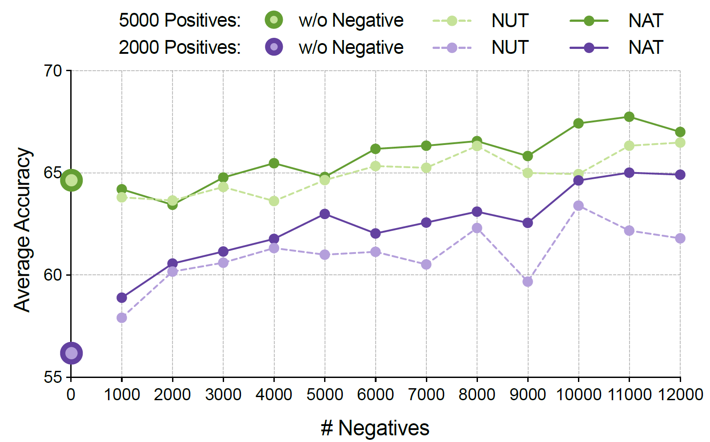
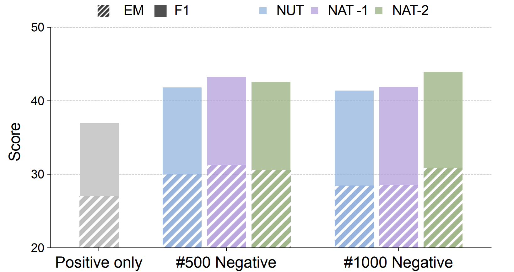

## Learning From $\textcolor{BrickRed}{\mathbf{Failure}}$: Integrating Negative Examples when Fine-tuning Large Language Models as Agents

    <a href="https://huggingface.co/reasonwang/NAT-math-13b">🤗Model (NAT-math-13b)</a>
    • 
	<a href="https://arxiv.org/pdf/2402.11651.pdf">📄Paper (arxiv)</a>
	• 
    <a href="https://huggingface.co/datasets/reasonwang/NATInstruct">🤗Dataset (math, qa)</a>

**NAT (Negative-Aware Training)** aims to push the limit of data efficiency by incorporating negative trajectories when fine-tuning Large Language Models as Agents. We find models' performance increases as we include more negative samples. Besides, our method (NAT) shows superior performance compared to directly including negative samples.

| 🤗Model                                                       | 📂Dataset                                                     |
| ------------------------------------------------------------ | ------------------------------------------------------------ |
| [NAT-math-7b](https://huggingface.co/reasonwang/NAT-math-7b) | [gsm8k positive](https://drive.google.com/file/d/1WENIKuRwJmrBQCEg2zCnmi4bhIXY4NP5/view?usp=sharing) |
| [NAT-math-13b](https://huggingface.co/reasonwang/NAT-math-13b) | [gsm8k negative](https://drive.google.com/file/d/15hJsOt5zKoO__X5qX0p5bueD2dPx90ib/view?usp=sharing) |
| [NAT-qa-7b](https://huggingface.co/reasonwang/NAT-qa-7b)     | [hotpotqa positive](https://drive.google.com/file/d/1TNs216WCdF7YwEqJSr0-QEaJE5TnKIpy/view?usp=sharing) |
| [NAT-qa-13b](https://huggingface.co/reasonwang/NAT-qa-13b)   | [hotpotqa negative](https://drive.google.com/file/d/10p2MNkQASk8roQrDq13PPkB4ZYayMX-L/view?usp=sharing) |
| [NAT-strategy-qa-7b](https://huggingface.co/reasonwang/NAT-strategy-qa-7b) | [strategyqa positive](https://drive.google.com/file/d/1OAZs1ok-GjKgno-1a-79ssMfjKrpgDrs/view?usp=sharing) |
| [NAT-strategy-qa-13b](https://huggingface.co/reasonwang/NAT-strategy-qa-13b) | [strategyqa negative](https://drive.google.com/file/d/1lRr1Rzxu4MC1DEBp3XgcrnZfGTTWBWjQ/view?usp=sharing) |

### Main Results

**Figure 1** and **Figure 2** show the result on math and question-answering tasks. For math, our method continues to enhance the performance when incorporating more negative samples. For both math and QA, our method achieves better results.

