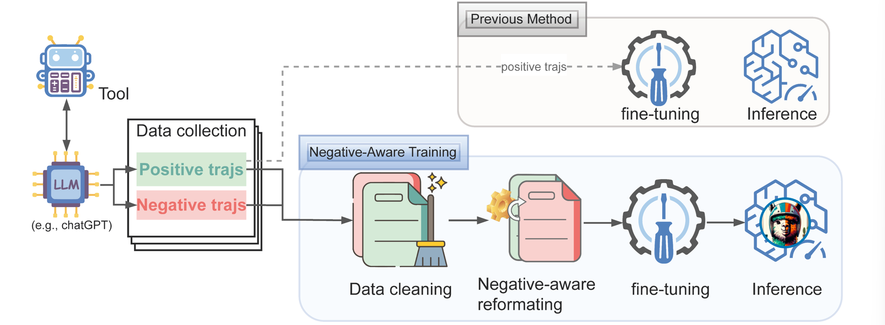

## Learning From $\textcolor{BrickRed}{\mathbf{Failure}}$: Integrating Negative Examples when Fine-tuning Large Language Models as Agents

    <a href="https://huggingface.co/reasonwang/NAT-math-13b">🤗Model (NAT-math-13b)</a>
    • 
	<a href="https://arxiv.org/pdf/2402.11651.pdf">📄Paper (arxiv)</a>
	• 
	📂Dataset (math, qa)

| 🤗Model                                                       |
| ------------------------------------------------------------ |
| [NAT-math-7b](https://huggingface.co/reasonwang/NAT-math-7b) |
| [NAT-math-13b](https://huggingface.co/reasonwang/NAT-math-13b) |
| [NAT-qa-7b](https://huggingface.co/reasonwang/NAT-qa-7b)     |
| [NAT-qa-13b](https://huggingface.co/reasonwang/NAT-qa-13b)   |
| [NAT-strategy-qa-7b](https://huggingface.co/reasonwang/NAT-strategy-qa-7b) |
| [NAT-strategy-qa-13b](https://huggingface.co/reasonwang/NAT-strategy-qa-13b) |

